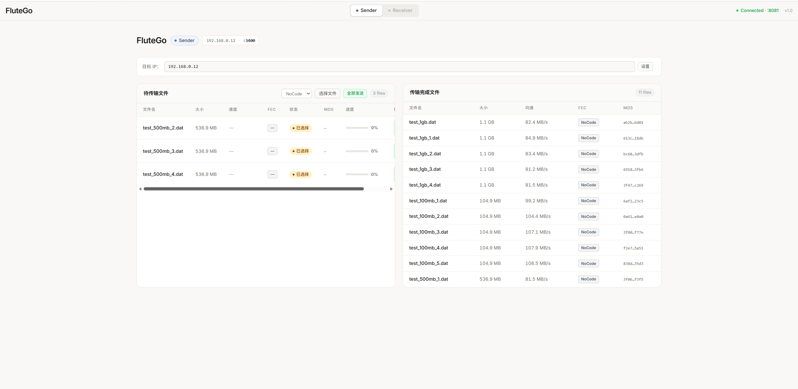
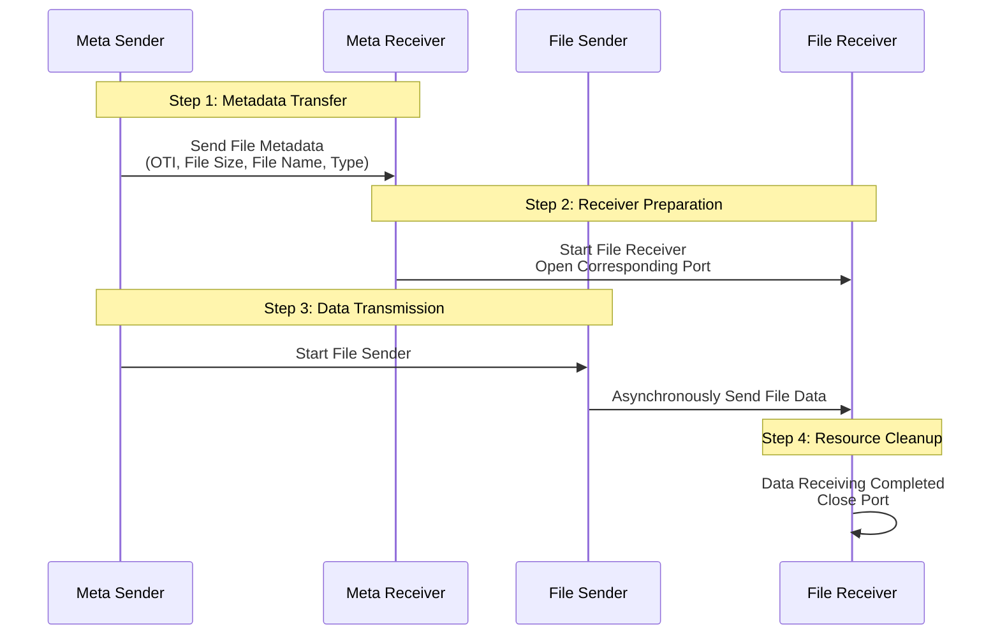

# **FluteGo - File Delivery over Unidirectional Transport in Go implementation**
## **Unicast File Transfer Solution for Small-Scale Scalable Deployments**

## Acknowledgments

- Protocol inspiration: [ypo/flute](https://github.com/ypo/flute) - FLUTE implementation in Rust

## Usage example




## RFC
This library implements the following RFCs 

| RFC      | Title                                                    | Link                                          |
| -------- | -------------------------------------------------------- | --------------------------------------------- |
| RFC 6726 | FLUTE - File Delivery over Unidirectional Transport      | <https://www.rfc-editor.org/rfc/rfc6726.html> |
| RFC 5052 | Forward Error Correction (FEC) Building Block            | <https://www.rfc-editor.org/rfc/rfc5052>      |
| RFC 5510 | Reed-Solomon Forward Error Correction (FEC) Schemes      | <https://www.rfc-editor.org/rfc/rfc5510.html> |

## Structure


## 开始使用前
[静态 ARP 配置说明](STATIC_ARP.md)

## 快速开始
1. Start receiver first

2. Then start sender

<!-- ## CLI Mode

Both sender and receiver support a CLI mode (`--cli` flag) that bypasses config files and API server for direct command-line operation.

### Usage

```bash
# Receiver CLI (listens for incoming files)
./flute_receiver_cli --cli --save-dir ~/Downloads --timeout 120

# Sender CLI (sends a file)
./flute_sender_cli --cli --dest-ip <RECEIVER_IP> --file <FILE_PATH> \
  --fec RaptorQ --send-redundancy-ratio 1.5 --rate-limit-mbps 200 --fdt-id 1
```

### CLI Flags

| Flag | Default | Description |
|------|---------|-------------|
| `--cli` | `false` | Enable CLI mode (no config, no API server) |
| `--dest-ip` | `""` | Receiver IP (required) |
| `--file` | `""` | File to send (required) |
| `--fec` | `"RaptorQ"` | FEC type: `NoCode`, `RaptorQ`, `ReedSolomon` |
| `--fdt-id` | `1` | File transfer ID (1-255, change to reuse receiver) |
| `--send-redundancy-ratio` | `1.05` | Redundancy ratio (higher = more repair symbols) |
| `--rate-limit-mbps` | `500` | Send rate limit (0 = unlimited) |
| `--max-packet-size` | `1408` | UDP packet size (bytes) |
| `--base-file-port` | `3400` | Base file transfer port |
| `--meta-port` | `3399` | Metadata port |
| `--num-ports` | `1` | Number of concurrent ports |
| `--start-send-wait` | `1` | Seconds to wait before data (MetaPkt → data gap) |
| `--save-dir` | `~/Downloads` | Receiver: file save directory |
| `--timeout` | `120` | Receiver: seconds before timeout (0 = no timeout) | -->


<!-- ## 丢包恢复测试（`--percentage` 参数）

`--percentage` 参数控制发送端**实际发送的数据量占总数据量的百分比**，用于在不引入网络丢包工具（如 clumsy）的情况下，测试 RaptorQ 的抗丢包恢复能力。

### 原理

发送端先计算理论上应发送的总数据量（含 FEC 冗余），然后只发送 `percentage%` 就停止。接收端收到的数据量少于预期，模拟了网络丢包场景。RaptorQ 解码器用收到的符号尝试恢复完整文件。

### 推荐组合

| 模拟丢包率 | `--percentage` | `--send-redundancy-ratio` | 预期结果 |
|-----------|---------------|--------------------------|---------|
| 0%（无丢包） | 100 | 1.05–1.25 | ✅ 稳定恢复 |
| 5% | 85 | 1.20–1.50 | ✅ 大概率恢复 |
| 10% | 80 | 1.50–2.00 | ✅ 大概率恢复（文件增大 50–100%） |
| 15% | 75 | 2.00–2.50 | ⚠️ 取决于丢包分布，交叉模式下可能失败 |
| 20% | 70 | 2.50–3.00 | ⚠️ 冗余开销大，文件增大 2–3× |
| 30% | 60 | 3.00–4.00 | ❌ 高概率失败 |

### 使用示例

```bash
# 发送 80% 的数据量，模拟 20% 丢包，冗余比 2.5×
./flute_sender_cli --cli --dest-ip 192.168.0.10 --file test_100mb.dat \
  --fec RaptorQ --send-redundancy-ratio 2.5 --percentage 80 --rate-limit-mbps 200
``` -->

### RaptorQ 恢复能力说明

- **RaptorQ 需要 ≥K 个不同符号**才能解码一个 chunk，K = ceil(chunkSize / symbolSize)。
- `send-redundancy-ratio` 控制每个 chunk 的额外符号数：`totalSymbols = ceil(K × ratio)`。
- 当 `percentage = 100/(ratio) × 100%` 时，发送端恰好发送 K 个基符号（无冗余），此时只要丢 1 个包就可能导致某个 chunk 解码失败。
- 推荐 `ratio = 1/(packetLossRate+0.01)` 作为安全值：例如丢包 5% 用 ratio=1.20，丢包 10% 用 ratio=1.50。
- 实际测试中因为丢包的随机分布，有时即使理论符号数足够也可能解码失败（关键符号集中丢失）。
- 大文件（1GB+）比小文件更容易恢复成功，因为丢包分散在更多 chunk 上，每个 chunk 丢包概率更低。

## 编译命令

### 一键编译所有平台

```bash
# 发送端
GOOS=darwin GOARCH=amd64 go build -o release/flute_sender_darwin_amd64 ./cmd/flute_sender/
GOOS=darwin GOARCH=arm64 go build -o release/flute_sender_darwin_arm64 ./cmd/flute_sender/
GOOS=windows GOARCH=amd64 go build -o release/flute_sender_windows_amd64.exe ./cmd/flute_sender/

# 接收端
GOOS=darwin GOARCH=amd64 go build -o release/flute_receiver_darwin_amd64 ./cmd/flute_receiver/
GOOS=darwin GOARCH=arm64 go build -o release/flute_receiver_darwin_arm64 ./cmd/flute_receiver/
GOOS=windows GOARCH=amd64 go build -o release/flute_receiver_windows_amd64.exe ./cmd/flute_receiver/
```

### 编译说明

| 平台 | GOOS | GOARCH | 输出文件名 |
|------|------|--------|-----------|
| macOS Intel | `darwin` | `amd64` | `flute_sender_darwin_amd64` / `flute_receiver_darwin_amd64` |
| macOS Apple Silicon (M1/M2/M3/M4) | `darwin` | `arm64` | `flute_sender_darwin_arm64` / `flute_receiver_darwin_arm64` |
| Windows 64-bit | `windows` | `amd64` | `flute_sender_windows_amd64.exe` / `flute_receiver_windows_amd64.exe` |

### 编译当前平台

```bash
# 直接编译（默认当前平台）
go build -o flute_sender ./cmd/flute_sender/
go build -o flute_receiver ./cmd/flute_receiver/
```

编译产物统一输出到 `release/` 目录，方便分发。

## 性能测试

两种测试场景：
- **Mac→Win**：Apple M4/16GB/macOS 26.2（发送端）→ AMD Ryzen/32GB/Win 11（接收端），**不限速**
- **Win→Mac**：AMD Ryzen/32GB/Win 11（发送端）→ Apple M4/16GB/macOS 26.2（接收端），**500 Mbps 限速**（另有无限速对照）

所有测试均在正常网络环境下进行，无人工丢包。FEC 配置：RaptorQ（1.25×）/ NoCode，chunk=32KB，symbol=1400B。取前 3 次成功传输平均值。

### 单文件传输

**Mac→Win（Mac 发送 → Win 接收，不限速）**

| FEC | 文件大小 | 耗时 | 有效速率 |
|-----|---------|------|---------|
| NoCode | 1 GB | 27.5 s | 313 Mbps |
| NoCode | 500 MB | 13.1 s | 328 Mbps |
| NoCode | 100 MB | 2.5 s | 331 Mbps |
| RaptorQ | 1 GB | 38.2 s | 227 Mbps |
| RaptorQ | 500 MB | 16.1 s | 267 Mbps |
| RaptorQ | 100 MB | 3.2 s | 262 Mbps |

**Win→Mac（Win 发送 → Mac 接收，不限速）**

| FEC | 文件大小 | 耗时 | 有效速率 |
|-----|---------|------|---------|
| NoCode | 1 GB | 11.9 s | 725 Mbps |
| NoCode | 500 MB | 5.9 s | 731 Mbps |
| NoCode | 100 MB | 1.1 s | 754 Mbps |
| RaptorQ | 1 GB | 13.2 s | 653 Mbps |
| RaptorQ | 500 MB | 6.6 s | 648 Mbps |
| RaptorQ | 100 MB | 1.2 s | 672 Mbps |

**Win→Mac（Win 发送 → Mac 接收，500 Mbps 限速）**

| FEC | 文件大小 | 耗时 | 有效速率 |
|-----|---------|------|---------|
| NoCode | 1 GB | 16.8 s | 512 Mbps |
| NoCode | 500 MB | 8.1 s | 528 Mbps |
| NoCode | 100 MB | 1.2 s | 706 Mbps |
| RaptorQ | 1 GB | 21.6 s | 397 Mbps |
| RaptorQ | 500 MB | 10.6 s | 406 Mbps |
| RaptorQ | 100 MB | 1.7 s | 504 Mbps |

- Win→Mac 不限速时发送端有效速率是 Mac→Win 的 **2.0–2.8×**，差距来自 Win 发送端 CPU（32核 vs 10核）及 NIC 驱动发包效率。
- Win→Mac 500 Mbps 限速下 NoCode 接近跑满限速（512–528 Mbps），RaptorQ 因 FEC 冗余开销（28.9%）有效速率约 400 Mbps。
- Mac→Win 不限速时 Mac 发送端 10 核性能有限，NoCode 约 313–331 Mbps、RaptorQ 约 227–267 Mbps。
- RaptorQ 开销 28.9%（1.25× 冗余 + 8 字节头部），NoCode 仅 0.6% 头部开销。

### 并发传输（Win→Mac）

**NoCode（500 Mbps 限速）**

| 场景 | 文件数 | 平均耗时 | 平均有效速率 |
|------|--------|---------|--------------|
| 5 × 1 GB | 5 | 60.1 s | 147 Mbps |
| 4 × 500 MB | 4 | 32.8 s | 131 Mbps |
| 5 × 100 MB | 5 | 7.4 s | 129 Mbps |

**RaptorQ（不限速）**

| 场景 | 文件数 | 平均耗时 | 平均有效速率 |
|------|--------|---------|--------------|
| 5 × 100 MB | 5 | 3.6 s | 270 Mbps |
| 4 × 500 MB | 4 | 23.6 s | 183 Mbps |
| 5 × 1 GB | 5 | 41.1 s | 212 Mbps |

**RaptorQ（500 Mbps 限速）**

| 场景 | 文件数 | 平均耗时 | 平均有效速率 |
|------|--------|---------|--------------|
| 5 × 100 MB | 5 | 10.0 s | 92 Mbps |
| 4 × 500 MB | 4 | 45.0 s | 95 Mbps |
| 5 × 1 GB | 5 | 82.3 s | 106 Mbps |

**关键发现：**
- RaptorQ 不限速并发时首个文件获得最多带宽，后续均分，5 × 1 GB 总带宽约 1,060 Mbps（超 1 Gbps 链路极限）。
- 500 Mbps 限速下 5 文件均分带宽：NoCode ~130–147 Mbps/文件，RaptorQ ~92–106 Mbps/文件（FEC 冗余降低有效速率）。
- 100 MB 小文件并发时 RaptorQ 不限速可达 270 Mbps/文件（5 文件 → 总 1.35 Gbps，超链路极限，实际因 pipeline 效应首个文件更快）。
- RaptorQ 解码计算密集，限速场景下 CPU 成为瓶颈，速率低于 NoCode。

### 内存概况

| 场景 | 峰值堆内存 | 系统内存 | GC 次数 |
|------|-----------|---------|---------|
| Mac→Win NoCode 1 GB 单文件（接收端 Win） | 8–17 MB | 28 MB | ~5200–5700 |
| Mac→Win RaptorQ 1 GB 单文件（接收端 Win） | 13–19 MB | 32–36 MB | ~4150–4250 |
| Win→Mac RaptorQ 1 GB 单文件（不限速） | 14–19 MB | 42 MB | ~4460 |
| Win→Mac NoCode 1 GB 单文件（不限速） | 9–14 MB | 26–98 MB | ~7700 |
<!-- | Win→Mac 5×1GB RaptorQ 并发（不限速） | 25–41 MB | 99 MB | ~4300–5400 |
| Win→Mac 5×1GB NoCode 并发（500M限速） | 12–31 MB | 58 MB | ~7300–10600 | -->

- Win 发送端内存稳定（14–19 MB），无 FEC 解码状态。
- NoCode GC 高于 RaptorQ（`sync.Pool` 写缓冲无状态缓存），限速场景因耗时拉长 GC 最高。
- 所有场景内存稳定，无泄漏。

### 接收端收包统计

| 场景 | FEC | 预期包数 | 实际收包 | 比率 |
|------|-----|---------|---------|------|
| Mac→Win | RaptorQ | 786,432（1 GB） | 983,040 | 125.00% |
| Mac→Win | NoCode | 精确相等 | 精确相等 | 100.00% |
| Win→Mac | RaptorQ（不限速） | 786,432（1 GB） | 982,981–983,040 | 125.00% |
| Win→Mac | RaptorQ（500M限速） | 786,432（1 GB） | 983,040 | 125.00% |
| Win→Mac | NoCode | 精确相等 | 精确相等 | 100.00% |

- RaptorQ 收包率精确匹配 `基符号数 × 冗余比`，不限速和限速均稳定 125.00%。
- NoCode 零丢包，100% 精确匹配。

## RaptorQ Recovery Formula

### Parameters

| Symbol | Meaning | How to compute |
|--------|---------|---------------|
| `S` | symbol size (bytes) | `maxPacketSize - 8` |
| `C` | chunk size (bytes) | OTI `MaximumChunkSize` (default 32768) |
| `F` | file size (bytes) | `os.Stat()` |
| `R` | redundancy ratio | `--send-redundancy-ratio` |
| `D` | drop probability | `1.0 - percentage/100` |

### Derived values

```
baseSymbols   B = ceil(C / S)
totalSymbols  T = ceil(B * R)
chunkCount    N = ceil(F / C)
sendRate      p = 1 - D
```

### Recovery condition

A transfer **succeeds** when every chunk receives enough symbols to decode.
With random independent packet loss at rate D, the probability a single chunk fails is:

```
P(fail per chunk) = P( Binomial(T, p) < B )
```

For `N` chunks to all succeed with high confidence:

```
P(fail per chunk) * N  <  0.5    (expected failures < 1)
```

### Verified boundaries (Windows localhost, RaptorQ, rate-limit=0)

**100 MB file (N = 3,200 chunks):**

| R | T | p min | Loss max | Overhead | Validated |
|---|----|---------|----------|----------|-----------|
| 1.30 | 32 | 0.95 | 5% | +30% | OK |
| 1.50 | 36 | 0.90 | 10% | +50% | OK |
| 1.60 | 39 | 0.85 | 15% | +60% | OK |
| 2.00 | 48 | 0.75 | 25% | +100% | OK |
| 2.50 | 60 | 0.60 | 40% | +150% | OK |
| 3.00 | 72 | 0.60 | 40% | +200% | OK |

**1 GB file (N = 32,768 chunks):**

| R | T | p min | Loss max | Overhead | Validated |
|---|----|---------|----------|----------|-----------|
| 1.30 | 32 | 0.95 | 5% | +30% | OK |
| 1.50 | 36 | 0.90 | 10% | +50% | OK |
| 1.75 | 42 | 0.85 | 15% | +75% | OK |
| 2.00 | 48 | 0.80 | 20% | +100% | OK |
| 2.50 | 60 | 0.70 | 30% | +150% | OK |
| 3.00 | 72 | 0.60 | 40% | +200% | OK |

### Key insight

Larger files have **more chunks** → higher chance of an extreme outlier.
For a 1 GB file (32,768 chunks) you need **~1 extra symbol per chunk** of safety margin compared to a 100 MB file.

### Quick reference

```bash
# 5% loss  -> ratio >= 1.3
# 10% loss -> ratio >= 1.5
# 15% loss -> ratio >= 1.75
# 20% loss -> ratio >= 2.0
# 30% loss -> ratio >= 2.5
# 40% loss -> ratio >= 3.0
```

