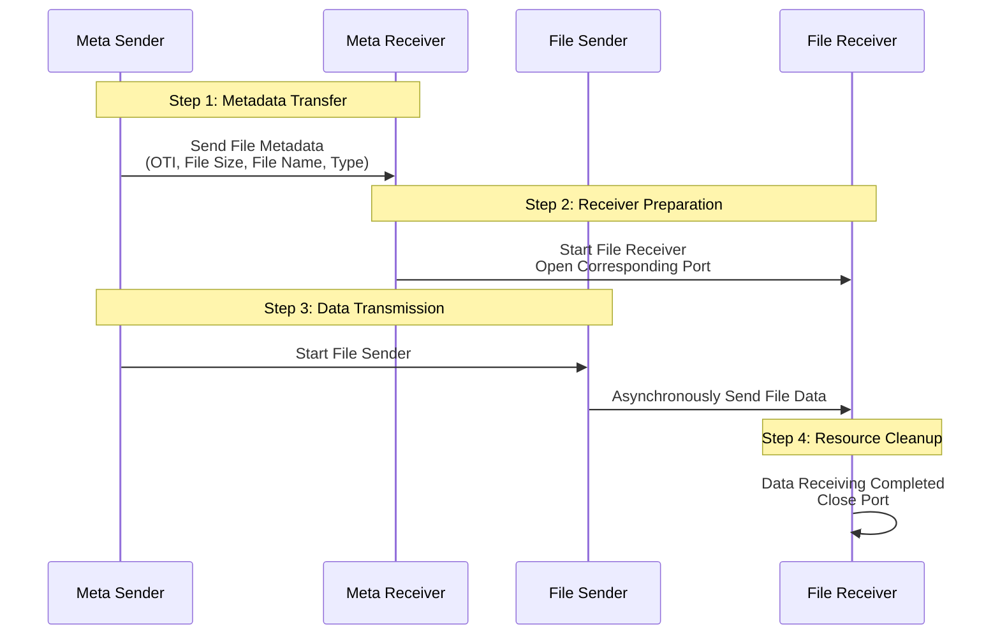

# **FluteGo - File Delivery over Unidirectional Transport in Go implementation**
## **Unicast File Transfer Solution for Small-Scale Scalable Deployments**

## Acknowledgments

- Protocol inspiration: [ypo/flute](https://github.com/ypo/flute) - FLUTE implementation in Rust

## RFC
This library implements the following RFCs 

| RFC      | Title                                                    | Link                                          |
| -------- | -------------------------------------------------------- | --------------------------------------------- |
| RFC 6726 | FLUTE - File Delivery over Unidirectional Transport      | <https://www.rfc-editor.org/rfc/rfc6726.html> |
| RFC 5775 | Asynchronous Layered Coding (ALC) Protocol Instantiation | <https://www.rfc-editor.org/rfc/rfc5775.html> |
| RFC 5052 | Forward Error Correction (FEC) Building Block            | <https://www.rfc-editor.org/rfc/rfc5052>      |
| RFC 5510 | Reed-Solomon Forward Error Correction (FEC) Schemes      | <https://www.rfc-editor.org/rfc/rfc5510.html> |

## Structure


## Initialization
### Network interface configuration (Linux)
#### Receiver
```zsh
# Clear ARP table
sudo ip neighbor flush dev <recv_interface>
# Add IP address
sudo ip addr add <receiver_ip> dev <recv_interface>
# Enable network interface (if not already enabled)
sudo ip link set <recv_interface> up

# Delete old entry (if exists) and add new entry
sudo ip neighbor del <sender_ip> dev <recv_interface> 2>/dev/null
sudo ip neighbor add <sender_ip> lladdr <sender_mac> dev <recv_interface> nud noarp
```
#### Sender
```zsh
# Clear ARP table
sudo ip neighbor flush dev <send_interface>
# Add IP address
sudo ip addr add <sender_ip> dev <send_interface>
# Enable network interface
sudo ip link set <send_interface> up

# Delete old entry (if exists) and add new entry
sudo ip neighbor del <receiver_ip> dev <send_interface> 2>/dev/null
sudo ip neighbor add <receiver_ip> lladdr <receiver_mac> dev <send_interface> nud noarp
```
#### Recomended UDP kernel parameter configuration 
```zsh
# Adjust UDP buffer size
sudo sysctl -w net.core.rmem_max=134217728  # Set maximum receive buffer to 128 MB
sudo sysctl -w net.core.rmem_default=134217728  # Set default receive buffer to 128 MB
sudo sysctl -w net.core.wmem_max=134217728
sudo sysctl -w net.core.netdev_max_backlog=65535
```
## Use
1. Start receiver first

2. Then start sender

## Some simple test data(update later)
1. No-code
```txt
// sender
fdtID(1): send finished at 2025-12-13T01:11:37.0970134+08:00, duration=20.8879553s
fdtID(1): bytes sent=2623265565, duration=20.8879553s, throughput=1004.70 Mbps
fdtID(1): file size=2607984405, effective rate (goodput)=998.85 Mbps

Total Allocated Memory: 48970936 bytes
Peak Heap Memory: 1797600 bytes, 1 MB
System Memory (Sys): 13 MB
Heap Idle Memory: 5 MB
Garbage Collection Count: 23
Memory Allocation Count: 1950042
Heap Objects Count: 892

// receiver
File transfer completed (fdtID=1): 79590/79590 chunks, duration=20.8884996s
fdtID(1): bytes received=2607951637, duration=20.8884996s, throughput=998.81 Mbps

Total Allocated Memory: 66895867632 bytes
Peak Heap Memory: 2771680 bytes, 2 MB
System Memory (Sys): 255 MB
Heap Idle Memory: 239 MB
Garbage Collection Count: 16515
Memory Allocation Count: 15622947
Heap Objects Count: 2297
```

2. RaptorQ
```txt
// sender
fdtID(1): send finished at 2025-12-13T01:16:09.4768169+08:00, duration=31.5720935s
fdtID(1): bytes sent=2913608192, duration=31.5720935s, throughput=738.27 Mbps
fdtID(1): file size=2607984405, effective rate (goodput)=660.83 Mbps

Total Allocated Memory: 44298828120 bytes
Peak Heap Memory: 7910144 bytes, 7 MB
System Memory (Sys): 38 MB
Heap Idle Memory: 23 MB
Garbage Collection Count: 11550
Memory Allocation Count: 7656990
Heap Objects Count: 2381

// receiver
File transfer completed (fdtID=1): 79590/79590 chunks, duration=31.5720935s
fdtID(1): bytes received=2607656725, duration=31.5720935s, throughput=660.75 Mbps

Total Allocated Memory: 47307458680 bytes
Peak Heap Memory: 403781312 bytes, 385 MB
System Memory (Sys): 461 MB
Heap Idle Memory: 46 MB
Garbage Collection Count: 853
Memory Allocation Count: 12690509
Heap Objects Count: 882615
```

3. Reed-Solomon
```txt
// sender 
fdtID(1): send finished at 2025-12-13T01:20:37.4505733+08:00, duration=2m4.6354379s
fdtID(1): bytes sent=3497183008, duration=2m4.6354379s, throughput=224.47 Mbps
fdtID(1): file size=2607984405, effective rate (goodput)=167.40 Mbps

Total Allocated Memory: 804234784 bytes
Peak Heap Memory: 3760976 bytes, 3 MB
System Memory (Sys): 144 MB
Heap Idle Memory: 129 MB
Garbage Collection Count: 294
Memory Allocation Count: 13047886
Heap Objects Count: 23402

// receiver 
Total Allocated Memory: 3101396056 bytes
Peak Heap Memory: 720323936 bytes, 686 MB
System Memory (Sys): 1173 MB
Heap Idle Memory: 463 MB
Garbage Collection Count: 188
Memory Allocation Count: 10056741
Heap Objects Count: 465617
```