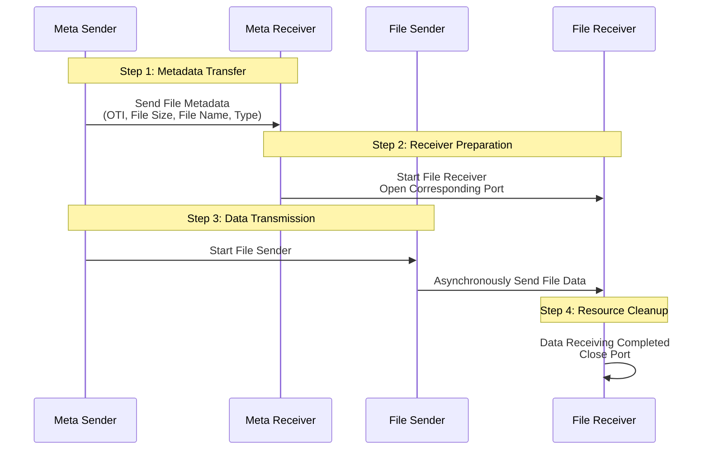

# **FluteGo - File Delivery over Unidirectional Transport in Go implementation**
## **Unicast File Transfer Solution for Small-Scale Scalable Deployments**

## Acknowledgments

- Protocol inspiration: [ypo/flute](https://github.com/ypo/flute) - FLUTE implementation in Rust

## RFC
This library implements the following RFCs 

| RFC      | Title                                                    | Link                                          |
| -------- | -------------------------------------------------------- | --------------------------------------------- |
| RFC 6726 | FLUTE - File Delivery over Unidirectional Transport      | <https://www.rfc-editor.org/rfc/rfc6726.html> |
| RFC 5052 | Forward Error Correction (FEC) Building Block            | <https://www.rfc-editor.org/rfc/rfc5052>      |
| RFC 5510 | Reed-Solomon Forward Error Correction (FEC) Schemes      | <https://www.rfc-editor.org/rfc/rfc5510.html> |

## Structure


<!-- ## Initialization
### Network interface configuration (Linux)
#### Receiver
```zsh
# Clear ARP table
sudo ip neighbor flush dev <recv_interface>
# Add IP address
sudo ip addr add <receiver_ip> dev <recv_interface>
# Enable network interface (if not already enabled)
sudo ip link set <recv_interface> up

# Delete old entry (if exists) and add new entry
sudo ip neighbor del <sender_ip> dev <recv_interface> 2>/dev/null
sudo ip neighbor add <sender_ip> lladdr <sender_mac> dev <recv_interface> nud noarp
```
#### Sender
```zsh
# Clear ARP table
sudo ip neighbor flush dev <send_interface>
# Add IP address
sudo ip addr add <sender_ip> dev <send_interface>
# Enable network interface
sudo ip link set <send_interface> up

# Delete old entry (if exists) and add new entry
sudo ip neighbor del <receiver_ip> dev <send_interface> 2>/dev/null
sudo ip neighbor add <receiver_ip> lladdr <receiver_mac> dev <send_interface> nud noarp
```
#### Recomended UDP kernel parameter configuration 
```zsh
# Adjust UDP buffer size
sudo sysctl -w net.core.rmem_max=134217728  # Set maximum receive buffer to 128 MB
sudo sysctl -w net.core.rmem_default=134217728  # Set default receive buffer to 128 MB
sudo sysctl -w net.core.wmem_max=134217728
sudo sysctl -w net.core.netdev_max_backlog=65535
``` -->
## Use
1. Start receiver first

2. Then start sender

## Test Data

测试用随机二进制文件，位于 `test_data/` 目录：

| 文件名 | 尺寸 | 精确字节数 | MD5 校验和 |
|--------|------|-----------|------------|
| `test_100mb.dat` | 100 MB | 104,857,600 | `ecd55cfa10bc97c7c6c2dfbe00102ef7` |
| `test_500mb.dat` | 500 MB | 524,288,000 | `804ac9e1379058f086f6656b5c093cfd` |
| `test_1gb.dat` | 1 GB | 1,073,741,824 | `ab2b3f2debd1713b40d596dce0dabd01` |

udp and (ip.SrcAddr == 192.168.0.12 or ip.DstAddr == 192.168.0.12)

## CLI Mode

Both sender and receiver support a CLI mode (`--cli` flag) that bypasses config files and API server for direct command-line operation.

### Usage

```bash
# Receiver CLI (listens for incoming files)
./flute_receiver_cli --cli --save-dir ~/Downloads --timeout 120

# Sender CLI (sends a file)
./flute_sender_cli --cli --dest-ip <RECEIVER_IP> --file <FILE_PATH> \
  --fec RaptorQ --send-redundancy-ratio 1.5 --rate-limit-mbps 200 --fdt-id 1
```

### CLI Flags

| Flag | Default | Description |
|------|---------|-------------|
| `--cli` | `false` | Enable CLI mode (no config, no API server) |
| `--dest-ip` | `""` | Receiver IP (required) |
| `--file` | `""` | File to send (required) |
| `--fec` | `"RaptorQ"` | FEC type: `NoCode`, `RaptorQ`, `ReedSolomon` |
| `--fdt-id` | `1` | File transfer ID (1-255, change to reuse receiver) |
| `--send-redundancy-ratio` | `1.05` | Redundancy ratio (higher = more repair symbols) |
| `--rate-limit-mbps` | `500` | Send rate limit (0 = unlimited) |
| `--max-packet-size` | `1408` | UDP packet size (bytes) |
| `--base-file-port` | `3400` | Base file transfer port |
| `--meta-port` | `3399` | Metadata port |
| `--num-ports` | `1` | Number of concurrent ports |
| `--start-send-wait` | `1` | Seconds to wait before data (MetaPkt → data gap) |
| `--save-dir` | `~/Downloads` | Receiver: file save directory |
| `--timeout` | `120` | Receiver: seconds before timeout (0 = no timeout) |

## Performance Benchmarks

Test environment: Windows 11 (sender/receiver) ↔ macOS (receiver/sender), 192.168.0.x LAN, RaptorQ FEC.

### Baseline (No Packet Loss)

```
 Direction   File     Ratio  Rate Limit   Goodput       Duration   MD5
 ────────── ──────── ────── ─────────── ──────────  ─────────── ─────
 Win → Mac   100 MB   1.01     200 Mbps   209 Mbps      4.01 s    ✅
 Win → Mac   100 MB   1.01     500 Mbps   644 Mbps      1.30 s    ✅*
 Win → Mac   100 MB   1.01    1000 Mbps   772 Mbps      1.09 s    ✅*
 Win → Mac   500 MB   1.01     500 Mbps   493 Mbps      8.51 s    ✅*
 Win → Mac     1 GB   1.01     500 Mbps   478 Mbps     17.96 s    ✅*
 Mac → Win   100 MB   1.01     100 Mbps    99 Mbps      8.51 s    ✅
 Mac → Win   100 MB   1.01     200 Mbps   209 Mbps      4.00 s    ✅
 Mac → Win   100 MB   1.01     500 Mbps   333 Mbps      2.52 s    ✅
 Mac → Win   100 MB   1.01    1000 Mbps   320 Mbps      2.62 s    ✅
 Mac → Win   100 MB   1.01    2000 Mbps   338 Mbps      2.48 s    ✅
 Mac → Win   100 MB   NoCode   500 Mbps   346 Mbps      2.42 s    ✅
 Mac → Win   500 MB   1.01     500 Mbps   319 Mbps     13.14 s    ✅
 Mac → Win   500 MB   1.01    1000 Mbps   338 Mbps     12.39 s    ✅
 Mac → Win     1 GB   1.01     500 Mbps   326 Mbps     26.38 s    ✅
 Mac → Win     1 GB   1.01    1000 Mbps   326 Mbps     26.37 s    ✅
```
*\* Sender reported goodput; receiver MD5 confirmed for fdtID=1.*

### With Clumsy Packet Loss (Inbound, Mac → Win, 200 Mbps)

```
 Loss%  File     Ratio   Goodput      Result
 ───── ──────── ────── ──────────  ──────────────────
   5%   100 MB   1.05      N/A       ❌ STALLED (78k/86k pkts)
   5%   100 MB   1.10      N/A       ❌ STALLED (81k/86k pkts)
   5%   100 MB   1.20      N/A       ❌ STALLED (87k/86k pkts)
   5%   100 MB   1.50    140 Mbps    ✅ MD5 OK
   5%   500 MB   1.50    131 Mbps    ✅ MD5 OK
   5%     1 GB   1.50    130 Mbps    ✅ MD5 OK

  20%   100 MB   2.00    103 Mbps    ✅ MD5 OK (at 200 Mbps)
  20%   100 MB   2.00    153 Mbps    ✅ MD5 OK (at 500 Mbps)

  30%   100 MB   2.50     81 Mbps    ✅ MD5 OK (only passing case)
  30%   500 MB   all      N/A        ❌ All failed
  30%     1 GB   all      N/A        ❌ All failed
```

### Key Findings

1. **Rate limit beyond ~500 Mbps provides diminishing returns** — actual throughput caps at ~770 Mbps (WiFi bottleneck on Mac)
2. **WiFi → Ethernet (Win→Mac) is ~2× faster** than Ethernet → WiFi (Mac→Win) due to WiFi asymmetry
3. **For Clumsy-assisted testing**, the actual loss rate exceeds Clumsy's configured drop due to WinDivert buffer overflow under high throughput
4. **Recommended parameters for reliable transfer under packet loss:**
   - `--fec RaptorQ` (NoCode cannot recover any loss)
   - `--send-redundancy-ratio 1.5` (covers up to ~5% loss)
   - `--rate-limit-mbps 200` (balances speed vs WinDivert stability)
   - For higher loss (20%+), increase ratio to 2.0-2.5
5. **MetaPkt is a single point of failure** — it is sent once; if dropped by filtering, the entire transfer fails. The receiver ignores duplicate fdtIDs.
