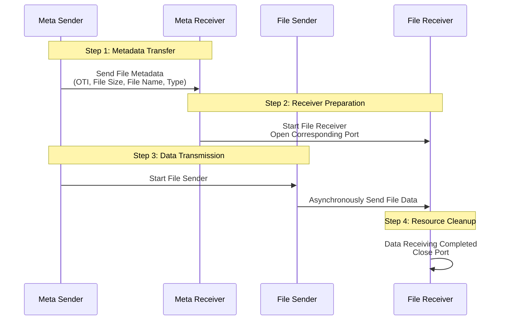

# **FluteGo - File Delivery over Unidirectional Transport in Go implementation**
## **Unicast File Transfer Solution for Small-Scale Scalable Deployments**

## Acknowledgments

- Protocol inspiration: [ypo/flute](https://github.com/ypo/flute) - FLUTE implementation in Rust

## RFC
This library implements the following RFCs 

| RFC      | Title                                                    | Link                                          |
| -------- | -------------------------------------------------------- | --------------------------------------------- |
| RFC 6726 | FLUTE - File Delivery over Unidirectional Transport      | <https://www.rfc-editor.org/rfc/rfc6726.html> |
| RFC 5052 | Forward Error Correction (FEC) Building Block            | <https://www.rfc-editor.org/rfc/rfc5052>      |
| RFC 5510 | Reed-Solomon Forward Error Correction (FEC) Schemes      | <https://www.rfc-editor.org/rfc/rfc5510.html> |

## Structure


<!-- ## Initialization
### Network interface configuration (Linux)
#### Receiver
```zsh
# Clear ARP table
sudo ip neighbor flush dev <recv_interface>
# Add IP address
sudo ip addr add <receiver_ip> dev <recv_interface>
# Enable network interface (if not already enabled)
sudo ip link set <recv_interface> up

# Delete old entry (if exists) and add new entry
sudo ip neighbor del <sender_ip> dev <recv_interface> 2>/dev/null
sudo ip neighbor add <sender_ip> lladdr <sender_mac> dev <recv_interface> nud noarp
```
#### Sender
```zsh
# Clear ARP table
sudo ip neighbor flush dev <send_interface>
# Add IP address
sudo ip addr add <sender_ip> dev <send_interface>
# Enable network interface
sudo ip link set <send_interface> up

# Delete old entry (if exists) and add new entry
sudo ip neighbor del <receiver_ip> dev <send_interface> 2>/dev/null
sudo ip neighbor add <receiver_ip> lladdr <receiver_mac> dev <send_interface> nud noarp
```
#### Recomended UDP kernel parameter configuration 
```zsh
# Adjust UDP buffer size
sudo sysctl -w net.core.rmem_max=134217728  # Set maximum receive buffer to 128 MB
sudo sysctl -w net.core.rmem_default=134217728  # Set default receive buffer to 128 MB
sudo sysctl -w net.core.wmem_max=134217728
sudo sysctl -w net.core.netdev_max_backlog=65535
``` -->
## Use
1. Start receiver first

2. Then start sender

## Some simple test data(update later)
1. No-code
```txt
// sender
fdtID(1): send finished at 2025-12-13T16:46:00.5466809+08:00, duration=14.8905013s
fdtID(1): bytes sent=2623265565, duration=14.8905013s, throughput=1409.36 Mbps
fdtID(1): total chunks sent=79590
fdtID(1): file size=2607984405, effective rate (goodput)=1401.15 Mbps

Total Allocated Memory: 61161192 bytes
Peak Heap Memory: 2115048 bytes, 2 MB
System Memory (Sys): 34 MB
Heap Idle Memory: 19 MB
Garbage Collection Count: 63
Memory Allocation Count: 2041224
Heap Objects Count: 1495

// receiver
File transfer completed (fdtID=1): 79590/79590 chunks, duration=14.8915486s
fdtID(1): bytes received=2607841280, duration=14.8915486s, throughput=1400.98 Mbps

Total Allocated Memory: 66861540040 bytes
Peak Heap Memory: 7269576 bytes, 6 MB
System Memory (Sys): 138 MB
Heap Idle Memory: 118 MB
Garbage Collection Count: 13188
Memory Allocation Count: 15615392
Heap Objects Count: 3668
```

2. RaptorQ
```txt
// sender
fdtID(1): send finished at 2025-12-13T01:16:09.4768169+08:00, duration=31.5720935s
fdtID(1): bytes sent=2913608192, duration=31.5720935s, throughput=738.27 Mbps
fdtID(1): file size=2607984405, effective rate (goodput)=660.83 Mbps

Total Allocated Memory: 44298828120 bytes
Peak Heap Memory: 7910144 bytes, 7 MB
System Memory (Sys): 38 MB
Heap Idle Memory: 23 MB
Garbage Collection Count: 11550
Memory Allocation Count: 7656990
Heap Objects Count: 2381

// receiver
File transfer completed (fdtID=1): 79590/79590 chunks, duration=31.5720935s
fdtID(1): bytes received=2607656725, duration=31.5720935s, throughput=660.75 Mbps

Total Allocated Memory: 47307458680 bytes
Peak Heap Memory: 403781312 bytes, 385 MB
System Memory (Sys): 461 MB
Heap Idle Memory: 46 MB
Garbage Collection Count: 853
Memory Allocation Count: 12690509
Heap Objects Count: 882615
```

3. Reed-Solomon
```txt
// sender 
fdtID(1): send finished at 2025-12-13T01:20:37.4505733+08:00, duration=2m4.6354379s
fdtID(1): bytes sent=3497183008, duration=2m4.6354379s, throughput=224.47 Mbps
fdtID(1): file size=2607984405, effective rate (goodput)=167.40 Mbps

Total Allocated Memory: 804234784 bytes
Peak Heap Memory: 3760976 bytes, 3 MB
System Memory (Sys): 144 MB
Heap Idle Memory: 129 MB
Garbage Collection Count: 294
Memory Allocation Count: 13047886
Heap Objects Count: 23402

// receiver 
Total Allocated Memory: 3101396056 bytes
Peak Heap Memory: 720323936 bytes, 686 MB
System Memory (Sys): 1173 MB
Heap Idle Memory: 463 MB
Garbage Collection Count: 188
Memory Allocation Count: 10056741
Heap Objects Count: 465617
```

## sender_performance
|Timestamp                |FdtID|FileSize  |Duration(s)|Throughput(Mbps)|Goodput(Mbps)|TotalAlloc(Bytes)|PeakHeap(Bytes)|SysMem(MB)|HeapIdle(MB)|GCCount|Mallocs |HeapObjects|FEC_Type|RateLimit(Mbps)|MaxConcurrent|
|-------------------------|-----|----------|-----------|----------------|-------------|-----------------|---------------|----------|------------|-------|--------|-----------|--------|---------------|-------------|
|2025-12-14T00:22:51+08:00|1    |2607984405|14.890575  |1409.356231     |1401.146388  |61362376         |2513368        |35        |18          |56     |2045318 |10147      |NoCode  |1400           |1            |
|2025-12-14T00:23:08+08:00|2    |2080189947|11.856902  |1411.753973     |1403.530161  |49473128         |2544448        |35        |18          |43     |1630954 |9368       |NoCode  |1400           |1            |
|2025-12-14T00:23:27+08:00|3    |2527105113|14.425505  |1409.676766     |1401.465057  |58943224         |3329408        |35        |17          |49     |1981224 |37374      |NoCode  |1400           |1            |
|2025-12-14T00:23:51+08:00|4    |3202497698|18.307855  |1407.597909     |1399.398308  |73707296         |3275576        |35        |17          |62     |2509731 |33336      |NoCode  |1400           |1            |
|2025-12-14T00:24:40+08:00|1    |2607984405|20.155373  |1156.459122     |1035.152003  |46333068720      |7380632        |71        |50          |9845   |10817492|4917       |RaptorQ |1400           |1            |
|2025-12-14T00:25:05+08:00|2    |2080189947|16.500379  |1126.744152     |1008.553802  |36890663992      |4548256        |87        |68          |7690   |8530829 |4246       |RaptorQ |1400           |1            |
|2025-12-14T00:25:36+08:00|3    |2527105113|20.214052  |1117.342004     |1000.137959  |44875772800      |6138072        |87        |67          |9329   |10449872|4531       |RaptorQ |1400           |1            |
|2025-12-14T00:26:08+08:00|4    |3202497698|25.982231  |1101.611747     |986.057802   |56798459208      |7889976        |88        |64          |11632  |13136551|4795       |RaptorQ |1400           |1            |

## receiver_performance
|Timestamp                |FdtID|BytesReceived|Duration(s)|Throughput(Mbps)|TotalAlloc(Bytes)|PeakHeap(Bytes)|SysMem(MB)|HeapIdle(MB)|GCCount|Mallocs |HeapObjects|FEC_Type|
|-------------------------|-----|-------------|-----------|----------------|-----------------|---------------|----------|------------|-------|--------|-----------|--------|
|2025-12-14T00:22:51+08:00|1    |2607841280   |14.889989  |1401.124643     |66860083800      |6387952        |74        |55          |13095  |15625012|3640       |NoCode  |
|2025-12-14T00:23:08+08:00|2    |2080047104   |11.861199  |1402.925415     |53303039384      |5452328        |83        |64          |8845   |12447157|3466       |NoCode  |
|2025-12-14T00:23:27+08:00|3    |2526974041   |14.428133  |1401.137103     |64741731272      |11664144       |95        |69          |9963   |15115405|5138       |NoCode  |
|2025-12-14T00:23:51+08:00|4    |3202285568   |18.307331  |1399.345672     |82034563912      |12125960       |107       |80          |12130  |19150520|4449       |NoCode  |
|2025-12-14T00:24:40+08:00|1    |2607656725   |20.156483  |1034.964948     |47304083264      |405590360      |457       |41          |858    |12641904|814625     |RaptorQ |
|2025-12-14T00:25:05+08:00|2    |2079993339   |16.501013  |1008.419696     |37732360328      |242893448      |457       |193         |810    |10083884|627715     |RaptorQ |
|2025-12-14T00:25:36+08:00|3    |2527039577   |20.214649  |1000.082510     |45837533176      |289411128      |457       |145         |844    |12248861|763121     |RaptorQ |
|2025-12-14T00:26:08+08:00|4    |3202170018   |25.982738  |985.937677      |58085462496      |359687072      |534       |150         |894    |15520288|965800     |RaptorQ |
