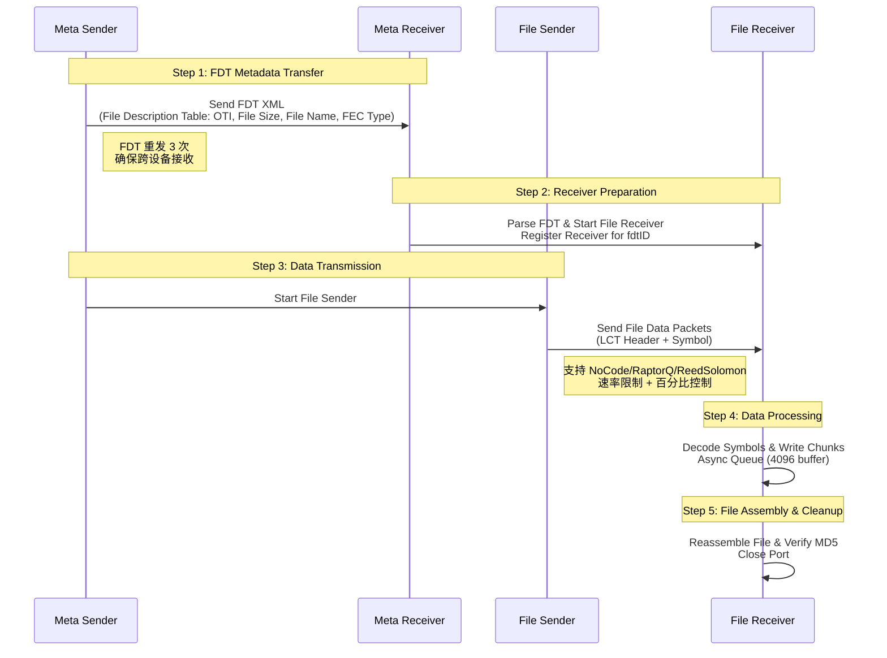

# **FluteGo - File Delivery over Unidirectional Transport in Go implementation**
## **Unicast File Transfer Solution for Small-Scale Scalable Deployments**

## Acknowledgments

- Protocol inspiration: [ypo/flute](https://github.com/ypo/flute) - FLUTE implementation in Rust

## Usage example


## RFC
This library implements the following RFCs 

| RFC      | Title                                                    | Link                                          |
| -------- | -------------------------------------------------------- | --------------------------------------------- |
| RFC 6726 | FLUTE - File Delivery over Unidirectional Transport      | <https://www.rfc-editor.org/rfc/rfc6726.html> |
| RFC 5052 | Forward Error Correction (FEC) Building Block            | <https://www.rfc-editor.org/rfc/rfc5052>      |
| RFC 5510 | Reed-Solomon Forward Error Correction (FEC) Schemes      | <https://www.rfc-editor.org/rfc/rfc5510.html> |

## Structure


## 传输模式

### 单播模式（Unicast）
- 发送端指定接收端 IP 地址，通过 UDP 单播传输文件
- 适用于点对点传输，支持跨网段（需路由可达）
- 配置简单，无需特殊网络设置

### 多播模式（Multicast）
- 使用多播地址（如 `239.1.1.1`）进行一对多传输
- 支持同一子网内多个接收端同时接收
- **发送端自动查路由表选择出口网卡**，无需手动指定
- 发送端设置 `IP_MULTICAST_TTL=2`，支持跨 1 个路由器
- 接收端自动在所有可用接口上加入多播组（`INADDR_ANY`）

**多播配置示例：**
```bash
# 发送端（自动选择网卡）
go run ./cmd/flute_sender/main.go --cli --file test.pdf --dest-ip 239.1.1.1

# 接收端
go run ./cmd/flute_receiver/main.go --cli --dest-ip 239.1.1.1
```

**手动指定网卡（多网卡环境需要显式控制时）：**
```bash
# 发送端（指定以太网接口 192.168.0.12）
go run ./cmd/flute_sender/main.go --cli --file test.pdf --dest-ip 239.1.1.1 --mcast-iface 192.168.0.12

# 接收端（指定以太网接口 192.168.0.10）
go run ./cmd/flute_receiver/main.go --cli --dest-ip 239.1.1.1 --mcast-iface 192.168.0.10
```

**注意：** 多播模式下，发送端和接收端必须在同一子网或相邻子网（TTL=2）。发送端默认通过查询系统路由表（`route -n get` / `ip route get`）自动确定出口网卡；路由查询失败时会回退到 `INADDR_ANY` 并提示手动指定 `--mcast-iface`。

---

### 网卡选择机制

发送端和接收端通过不同策略选择网络接口：

| 模式 | 发送端 | 接收端 |
|------|--------|--------|
| **单播** | 不指定网卡—由 **OS 路由表**根据目标 IP 决定出口接口 | 绑定到 `0.0.0.0`（所有接口）—内核在所有 UP 接口上监听 |
| **多播** | 默认查路由表（`route -n get` / `ip route get`）自动确定出口接口 → `IP_MULTICAST_IF` 设置出口；支持 `--mcast-iface` 手动覆盖 | 绑定到 `0.0.0.0` + `INADDR_ANY` 上 `IP_ADD_MEMBERSHIP`，内核在所有接口加入多播组 |

- 多播模式下发送端优先查路由表自动选择出口网卡；路由查询失败时回退到 `INADDR_ANY` 并提示手动指定 `--mcast-iface`。
- 接收端始终绑定 `0.0.0.0`，不主动选择网卡；多播时通过 `JoinMulticastGroup` 注册硬件过滤。

---

### 硬件地址（ARP）说明

FluteGo 运行在纯 UDP/IP 之上（`AF_INET` + `SOCK_DGRAM`），**不接触链路层**：

| 场景 | 发送端需要对方 MAC？ | 接收端需要对方 MAC？ | 原因 |
|------|---------------------|---------------------|------|
| **单播** | **需要**（静态 ARP 或 ARP 可达） | **不需要** | 以太网帧需要目标 MAC；单向信道中 ARP 请求无回复，故需手动配置静态 ARP |
| **多播** | **不需要** | **不需要** | 多播 MAC 由 IP 地址通过确定性算法算出（如 `239.1.1.1` → `01:00:5E:01:01:01`），无需 ARP |

> **关于 `IP_ADD_MEMBERSHIP`：** 接收端通过 `SetsockoptIPMreq(fd, IPPROTO_IP, IP_ADD_MEMBERSHIP, &mreq)` 加入多播组。此系统调用的核心作用是：
> 1. 更新**网卡硬件多播过滤表**，使网卡不再丢弃该组播 MAC 的帧
> 2. 设置**内核 socket 过滤规则**，将匹配的多播包投递到应用层
> 
> 在有 IGMP Snooping 交换机的网络环境下，内核会额外发送 IGMP Report 通知交换机；在**网线直连**场景（无交换机）下，IGMP Report 无接收方，但硬件过滤表已正确设置，数据仍能正常接收。
>
> FluteGo 本身不构建或解析 IGMP 报文——该协议由操作系统内核自动处理。

---

### IGMP 与多播转发

| 交换机配置 | 行为 |
|------------|------|
| **IGMP Snooping 关闭**（默认） | 组播帧作为广播帧向所有端口泛洪（flood），接收端总能收到 |
| **IGMP Snooping 开启** | 交换机监听 IGMP Report 建立 MAC→端口映射，组播流量只转发到注册过的端口 |

物理介质（光纤/铜缆）不影响 IGMP 行为——IGMP 是 IP 层协议，光纤交换机处理机制与电口交换机完全相同。

## 开始使用前
[静态 ARP 配置说明](STATIC_ARP.md)

## 快速开始
1. Start receiver first

2. Then start sender

<!-- ## CLI Mode

Both sender and receiver support a CLI mode (`--cli` flag) that bypasses config files and API server for direct command-line operation.

### Usage

```bash
# Receiver CLI (listens for incoming files)
./flute_receiver_cli --cli --save-dir ~/Downloads --timeout 120

# Sender CLI (sends a file)
./flute_sender_cli --cli --dest-ip <RECEIVER_IP> --file <FILE_PATH> \
  --fec RaptorQ --send-redundancy-ratio 1.5 --rate-limit-mbps 200 --fdt-id 1
```

### CLI Flags

| Flag | Default | Description |
|------|---------|-------------|
| `--cli` | `false` | Enable CLI mode (no config, no API server) |
| `--dest-ip` | `""` | Receiver IP (required) |
| `--file` | `""` | File to send (required) |
| `--fec` | `"RaptorQ"` | FEC type: `NoCode`, `RaptorQ`, `ReedSolomon` |
| `--fdt-id` | `1` | File transfer ID (1-255, change to reuse receiver) |
| `--send-redundancy-ratio` | `1.05` | Redundancy ratio (higher = more repair symbols) |
| `--rate-limit-mbps` | `500` | Send rate limit (0 = unlimited) |
| `--max-packet-size` | `1408` | UDP packet size (bytes) |
| `--base-file-port` | `3400` | Base file transfer port |
| `--meta-port` | `3399` | Metadata port |
| `--num-ports` | `1` | Number of concurrent ports |
| `--start-send-wait` | `1` | Seconds to wait before data (MetaPkt → data gap) |
| `--save-dir` | `~/Downloads` | Receiver: file save directory |
| `--timeout` | `120` | Receiver: seconds before timeout (0 = no timeout) | -->


<!-- ## 丢包恢复测试（`--percentage` 参数）

`--percentage` 参数控制发送端**实际发送的数据量占总数据量的百分比**，用于在不引入网络丢包工具（如 clumsy）的情况下，测试 RaptorQ 的抗丢包恢复能力。

### 原理

发送端先计算理论上应发送的总数据量（含 FEC 冗余），然后只发送 `percentage%` 就停止。接收端收到的数据量少于预期，模拟了网络丢包场景。RaptorQ 解码器用收到的符号尝试恢复完整文件。

### 推荐组合

| 模拟丢包率 | `--percentage` | `--send-redundancy-ratio` | 预期结果 |
|-----------|---------------|--------------------------|---------|
| 0%（无丢包） | 100 | 1.05–1.25 | ✅ 稳定恢复 |
| 5% | 85 | 1.20–1.50 | ✅ 大概率恢复 |
| 10% | 80 | 1.50–2.00 | ✅ 大概率恢复（文件增大 50–100%） |
| 15% | 75 | 2.00–2.50 | ⚠️ 取决于丢包分布，交叉模式下可能失败 |
| 20% | 70 | 2.50–3.00 | ⚠️ 冗余开销大，文件增大 2–3× |
| 30% | 60 | 3.00–4.00 | ❌ 高概率失败 |

### 使用示例

```bash
# 发送 80% 的数据量，模拟 20% 丢包，冗余比 2.5×
./flute_sender_cli --cli --dest-ip 192.168.0.10 --file test_100mb.dat \
  --fec RaptorQ --send-redundancy-ratio 2.5 --percentage 80 --rate-limit-mbps 200
``` -->

### RaptorQ 恢复能力说明

- **RaptorQ 需要 ≥K 个不同符号**才能解码一个 chunk，K = ceil(chunkSize / symbolSize)。
- `send-redundancy-ratio` 控制每个 chunk 的额外符号数：`totalSymbols = ceil(K × ratio)`。
- 当 `percentage = 100/(ratio) × 100%` 时，发送端恰好发送 K 个基符号（无冗余），此时只要丢 1 个包就可能导致某个 chunk 解码失败。
- 推荐 `ratio = 1/(packetLossRate+0.01)` 作为安全值：例如丢包 5% 用 ratio=1.20，丢包 10% 用 ratio=1.50。
- 实际测试中因为丢包的随机分布，有时即使理论符号数足够也可能解码失败（关键符号集中丢失）。
- 大文件（1GB+）比小文件更容易恢复成功，因为丢包分散在更多 chunk 上，每个 chunk 丢包概率更低。

## 编译命令

### 一键编译所有平台

```bash
# macOS Intel
GOOS=darwin GOARCH=amd64 go build -o release/flute_sender_darwin_amd64 ./cmd/flute_sender/
GOOS=darwin GOARCH=amd64 go build -o release/flute_receiver_darwin_amd64 ./cmd/flute_receiver/

# macOS Apple Silicon (M1/M2/M3/M4)
GOOS=darwin GOARCH=arm64 go build -o release/flute_sender_darwin_arm64 ./cmd/flute_sender/
GOOS=darwin GOARCH=arm64 go build -o release/flute_receiver_darwin_arm64 ./cmd/flute_receiver/

# Windows 64-bit
GOOS=windows GOARCH=amd64 go build -o release/flute_sender_windows_amd64.exe ./cmd/flute_sender/
GOOS=windows GOARCH=amd64 go build -o release/flute_receiver_windows_amd64.exe ./cmd/flute_receiver/
```

### 编译说明

| 平台 | GOOS | GOARCH | 输出文件名 |
|------|------|--------|-----------|
| macOS Intel | `darwin` | `amd64` | `flute_sender_darwin_amd64` / `flute_receiver_darwin_amd64` |
| macOS Apple Silicon (M1/M2/M3/M4) | `darwin` | `arm64` | `flute_sender_darwin_arm64` / `flute_receiver_darwin_arm64` |
| Windows 64-bit | `windows` | `amd64` | `flute_sender_windows_amd64.exe` / `flute_receiver_windows_amd64.exe` |

编译产物统一输出到 `release/` 目录，方便分发。

### 当前平台快速编译

```bash
# 直接编译（默认当前平台）
go build -o flute_sender ./cmd/flute_sender/
go build -o flute_receiver ./cmd/flute_receiver/
```

## 性能测试

<!-- 
两种测试场景：
- **Mac→Win**：Apple M4/16GB/macOS 26.2（发送端）→ AMD Ryzen/32GB/Win 11（接收端），**不限速**
- **Win→Mac**：AMD Ryzen 9 7940HX@5.2GHz/32GB/Win 11（发送端）→ Apple M4/16GB/macOS 26.2（接收端），**500 Mbps 限速**（另有无限速对照）

所有测试均在正常网络环境下进行，无人工丢包。FEC 配置：RaptorQ（1.25×）/ NoCode，chunk=32KB，symbol=1400B。取前 3 次成功传输平均值。

### 单文件传输

**Mac→Win（Mac 发送 → Win 接收，不限速）**

| FEC | 文件大小 | 耗时 | 有效速率 |
|-----|---------|------|---------|
| NoCode | 1 GB | 27.5 s | 313 Mbps |
| NoCode | 500 MB | 13.1 s | 328 Mbps |
| NoCode | 100 MB | 2.5 s | 331 Mbps |
| RaptorQ | 1 GB | 38.2 s | 227 Mbps |
| RaptorQ | 500 MB | 16.1 s | 267 Mbps |
| RaptorQ | 100 MB | 3.2 s | 262 Mbps |

**Win→Mac（Win 发送 → Mac 接收，不限速）**

| FEC | 文件大小 | 耗时 | 有效速率 |
|-----|---------|------|---------|
| NoCode | 1 GB | 11.9 s | 725 Mbps |
| NoCode | 500 MB | 5.9 s | 731 Mbps |
| NoCode | 100 MB | 1.1 s | 754 Mbps |
| RaptorQ | 1 GB | 13.2 s | 653 Mbps |
| RaptorQ | 500 MB | 6.6 s | 648 Mbps |
| RaptorQ | 100 MB | 1.2 s | 672 Mbps |

**Win→Mac（Win 发送 → Mac 接收，500 Mbps 限速）**

| FEC | 文件大小 | 耗时 | 有效速率 |
|-----|---------|------|---------|
| NoCode | 1 GB | 16.8 s | 512 Mbps |
| NoCode | 500 MB | 8.1 s | 528 Mbps |
| NoCode | 100 MB | 1.2 s | 706 Mbps |
| RaptorQ | 1 GB | 21.6 s | 397 Mbps |
| RaptorQ | 500 MB | 10.6 s | 406 Mbps |
| RaptorQ | 100 MB | 1.7 s | 504 Mbps |

- Win→Mac 不限速时发送端有效速率是 Mac→Win 的 **2.0–2.8×**，差距来自 Win 发送端 CPU（32核 vs 10核）及 NIC 驱动发包效率。
- Win→Mac 500 Mbps 限速下 NoCode 接近跑满限速（512–528 Mbps），RaptorQ 因 FEC 冗余开销（28.9%）有效速率约 400 Mbps。
- Mac→Win 不限速时 Mac 发送端 10 核性能有限，NoCode 约 313–331 Mbps、RaptorQ 约 227–267 Mbps。
- RaptorQ 开销 28.9%（1.25× 冗余 + 8 字节头部），NoCode 仅 0.6% 头部开销。

<!-- ### 并发传输（Win→Mac）

**NoCode（500 Mbps 限速）**

| 场景 | 文件数 | 平均耗时 | 平均有效速率 |
|------|--------|---------|--------------|
| 5 × 1 GB | 5 | 60.1 s | 147 Mbps |
| 4 × 500 MB | 4 | 32.8 s | 131 Mbps |
| 5 × 100 MB | 5 | 7.4 s | 129 Mbps |

**RaptorQ（不限速）**

| 场景 | 文件数 | 平均耗时 | 平均有效速率 |
|------|--------|---------|--------------|
| 5 × 100 MB | 5 | 3.6 s | 270 Mbps |
| 4 × 500 MB | 4 | 23.6 s | 183 Mbps |
| 5 × 1 GB | 5 | 41.1 s | 212 Mbps |

**RaptorQ（500 Mbps 限速）**

| 场景 | 文件数 | 平均耗时 | 平均有效速率 |
|------|--------|---------|--------------|
| 5 × 100 MB | 5 | 10.0 s | 92 Mbps |
| 4 × 500 MB | 4 | 45.0 s | 95 Mbps |
| 5 × 1 GB | 5 | 82.3 s | 106 Mbps |

**关键发现：**
- RaptorQ 不限速并发时首个文件获得最多带宽，后续均分，5 × 1 GB 总带宽约 1,060 Mbps（超 1 Gbps 链路极限）。
- 500 Mbps 限速下 5 文件均分带宽：NoCode ~130–147 Mbps/文件，RaptorQ ~92–106 Mbps/文件（FEC 冗余降低有效速率）。
- 100 MB 小文件并发时 RaptorQ 不限速可达 270 Mbps/文件（5 文件 → 总 1.35 Gbps，超链路极限，实际因 pipeline 效应首个文件更快）。
- RaptorQ 解码计算密集，限速场景下 CPU 成为瓶颈，速率低于 NoCode。

### 内存概况

| 场景 | 峰值堆内存 | 系统内存 | GC 次数 |
|------|-----------|---------|---------|
| Mac→Win NoCode 1 GB 单文件 | 8–17 MB | 28 MB | ~5200–5700 |
| Mac→Win RaptorQ 1 GB 单文件 | 13–19 MB | 32–36 MB | ~4150–4250 |
| Win→Mac RaptorQ 1 GB 单文件 | 14–19 MB | 42 MB | ~4460 |
| Win→Mac NoCode 1 GB 单文件 | 9–14 MB | 26–98 MB | ~7700 |
<!-- | Win→Mac 5×1GB RaptorQ 并发（不限速） | 25–41 MB | 99 MB | ~4300–5400 |
| Win→Mac 5×1GB NoCode 并发（500M限速） | 12–31 MB | 58 MB | ~7300–10600 | -->

<!-- - Win 发送端内存稳定（14–19 MB），无 FEC 解码状态。
- NoCode GC 高于 RaptorQ（`sync.Pool` 写缓冲无状态缓存），限速场景因耗时拉长 GC 最高。
- 所有场景内存稳定，无泄漏。 -->

<!-- ### 接收端收包统计

| 场景 | FEC | 预期包数 | 实际收包 | 比率 |
|------|-----|---------|---------|------|
| Mac→Win | RaptorQ | 786,432（1 GB） | 983,040 | 125.00% |
| Mac→Win | NoCode | 精确相等 | 精确相等 | 100.00% |
| Win→Mac | RaptorQ（不限速） | 786,432（1 GB） | 982,981–983,040 | 125.00% |
| Win→Mac | RaptorQ（500M限速） | 786,432（1 GB） | 983,040 | 125.00% |
| Win→Mac | NoCode | 精确相等 | 精确相等 | 100.00% |

- RaptorQ 收包率精确匹配 `基符号数 × 冗余比`，不限速和限速均稳定 125.00%。
- NoCode 零丢包，100% 精确匹配。
--> --> -->

### Win→Win 单文件传输（直连网线，不限速）

**测试环境：**
- 发送端 / 接收端：同一局域网两台 Windows 主机，千兆网线直连
- 参数：`SymbolSize = 1024B`，`ChunkSize = 1024 symbols (1MB)`，`MaxPacketSize = 1048B`
- 速率：不限速（`rateLimitMbps = 0`）
- 文件：`bin/test_{128,256,512,768,1024}MB.bin`（随机二进制，MD5 校验通过）
- 数据来源：`results/sender_performance.csv` + `results/transfer_stats.csv`
- 速率以发送端为准（接收端因异步处理存在统计偏差）

#### NoCode（0% 冗余）

**发送端性能（速率权威）：**

| 文件大小 | 耗时 (s) | 吞吐速率 (Mbps) | 有效速率 (Mbps) | 总发送包数 | 源符号数 | 修复符号数 |
|---------|---------|----------------|----------------|-----------|---------|-----------|
| 128 MB  | 2.314   | 474.84         | 463.97         | 131,072   | 131,072 | 0         |
| 256 MB  | 4.707   | 466.92         | 456.23         | 262,144   | 262,144 | 0         |
| 512 MB  | 9.717   | 452.37         | 442.01         | 524,288   | 524,288 | 0         |
| 768 MB  | 14.168  | 465.37         | 454.71         | 786,432   | 786,432 | 0         |
| 1024 MB | 19.579  | 449.03         | 438.74         | 1,048,576 | 1,048,576 | 0       |

**接收端统计：**

| 文件大小 | 收包数 | 收包率 | 完整性 | 峰值堆内存 (MB) | GC 次数 | 状态 |
|---------|--------|-------|--------|----------------|---------|------|
| 128 MB  | 131,072   | 100.00% | 128/128 chunks   | 52.3  | 47  | completed |
| 256 MB  | 262,144   | 100.00% | 256/256 chunks   | 52.6  | 105 | completed |
| 512 MB  | 524,288   | 100.00% | 512/512 chunks   | 81.6  | 200 | completed |
| 768 MB  | 786,432   | 100.00% | 768/768 chunks   | 22.3  | 295 | completed |
| 1024 MB | 1,048,576 | 100.00% | 1024/1024 chunks | 106.3 | 393 | completed |

#### RaptorQ（15% 冗余）

**发送端性能：**

| 文件大小 | 耗时 (s) | 吞吐速率 (Mbps) | 有效速率 (Mbps) | 总发送包数 | 源符号数 | 修复符号数 |
|---------|---------|----------------|----------------|-----------|---------|-----------|
| 128 MB  | 2.323   | 544.18         | 462.21         | 150,784   | 131,072 | 19,712    |
| 256 MB  | 4.713   | 536.47         | 455.66         | 301,568   | 262,144 | 39,424    |
| 512 MB  | 10.211  | 495.20         | 420.60         | 603,136   | 524,288 | 78,848    |
| 768 MB  | 14.974  | 506.54         | 430.24         | 904,704   | 786,432 | 118,272   |
| 1024 MB | 19.911  | 507.94         | 431.42         | 1,206,272 | 1,048,576 | 157,696 |

**接收端统计：**

| 文件大小 | 收包数 | 收包率 | 完整性 | 峰值堆内存 (MB) | GC 次数 | 状态 |
|---------|--------|-------|--------|----------------|---------|------|
| 128 MB  | 150,784   | 115.04% | 128/128 chunks   | 80.1  | 48  | completed |
| 256 MB  | 301,568   | 115.04% | 256/256 chunks   | 38.5  | 96  | completed |
| 512 MB  | 603,136   | 115.04% | 512/512 chunks   | 34.4  | 188 | completed |
| 768 MB  | 904,704   | 115.04% | 768/768 chunks   | 53.7  | 277 | completed |
| 1024 MB | 1,206,272 | 115.04% | 1024/1024 chunks | 77.7  | 362 | completed |
<!-- 
**关键发现：**
- 所有文件 MD5 校验通过，两种 FEC 在直连不限速环境下均稳定完成传输。
- NoCode 0% 冗余下收包率精确 100.00%，零丢包；有效速率 439–464 Mbps。
- RaptorQ 15% 冗余下收包率精确 115.04%，匹配 `1.15×` 冗余比；有效速率 420–462 Mbps。
- 两者吞吐速率接近（NoCode 449–475 Mbps，RaptorQ 495–544 Mbps），RaptorQ 总速率更高因多发了 15% 冗余包，但有效速率相当。
- 1024 MB 文件约 20 秒完成，峰值堆内存 NoCode 106 MB / RaptorQ 78 MB，内存控制良好。
- NoCode 开销：`SymRatio = 1.0156`，`WireRatio = 1.0234`（仅 24B LCT 头部），线缆开销约 2.3%。
- RaptorQ 开销：`SymRatio = 1.1684`，`WireRatio = 1.1774`（含冗余 + LCT 头部），线缆开销约 17.7%。 -->

