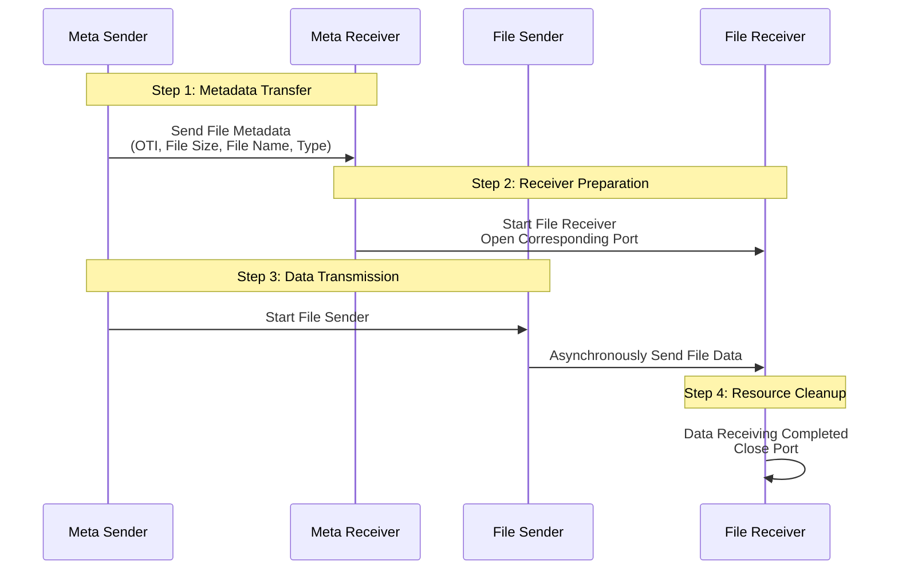

# **FluteGo - File Delivery over Unidirectional Transport in Go implementation**
## **Unicast File Transfer Solution for Small-Scale Scalable Deployments**

## RFC
This library implements the following RFCs 

| RFC      | Title                                                    | Link                                          |
| -------- | -------------------------------------------------------- | --------------------------------------------- |
| RFC 6726 | FLUTE - File Delivery over Unidirectional Transport      | <https://www.rfc-editor.org/rfc/rfc6726.html> |
| RFC 5775 | Asynchronous Layered Coding (ALC) Protocol Instantiation | <https://www.rfc-editor.org/rfc/rfc5775.html> |
| RFC 5052 | Forward Error Correction (FEC) Building Block            | <https://www.rfc-editor.org/rfc/rfc5052>      |
| RFC 5510 | Reed-Solomon Forward Error Correction (FEC) Schemes      | <https://www.rfc-editor.org/rfc/rfc5510.html> |

## Structure


## Initialization
### Network interface configuration (Linux)
#### Receiver
```zsh
# Clear ARP table
sudo ip neighbor flush dev <recv_interface>
# Add IP address
sudo ip addr add <receiver_ip> dev <recv_interface>
# Enable network interface (if not already enabled)
sudo ip link set <recv_interface> up

# Delete old entry (if exists) and add new entry
sudo ip neighbor del <sender_ip> dev <recv_interface> 2>/dev/null
sudo ip neighbor add <sender_ip> lladdr <sender_mac> dev <recv_interface> nud noarp
```
#### Sender
```zsh
# Clear ARP table
sudo ip neighbor flush dev <send_interface>
# Add IP address
sudo ip addr add <sender_ip> dev <send_interface>
# Enable network interface
sudo ip link set <send_interface> up

# Delete old entry (if exists) and add new entry
sudo ip neighbor del <receiver_ip> dev <send_interface> 2>/dev/null
sudo ip neighbor add <receiver_ip> lladdr <receiver_mac> dev <send_interface> nud noarp
```
#### UDP kernel parameter configuration
```zsh
# Adjust UDP buffer size
sudo sysctl -w net.core.rmem_max=134217728  # Set maximum receive buffer to 128 MB
sudo sysctl -w net.core.rmem_default=134217728  # Set default receive buffer to 128 MB
sudo sysctl -w net.core.wmem_max=134217728
sudo sysctl -w net.core.netdev_max_backlog=65535
```
## Use
1. Start receiver first
```zsh
./cmd/flute/flute_sender -dir <Directory containing files to send> -oti <"OTI Encoding ID: 0=NoCode, 1=RaptorQ, 2=Reed-Solomon"> -concurrent <Maximum number of concurrent file sends> -ip <Destination IP address>
```
2. Then start sender
```zsh
./cmd/flute/flute_receiver -dir <Directory containing files to send> -ip <Destination IP address>
```
